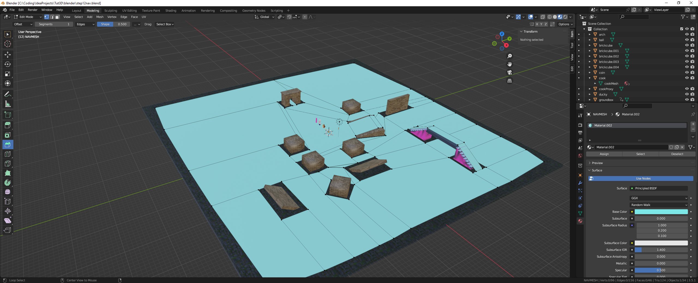
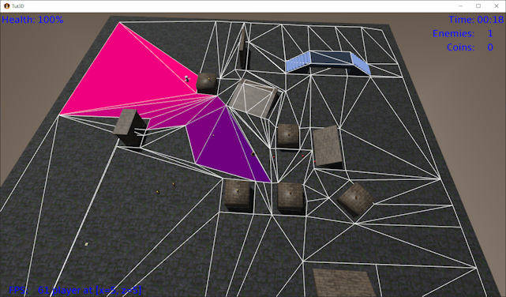
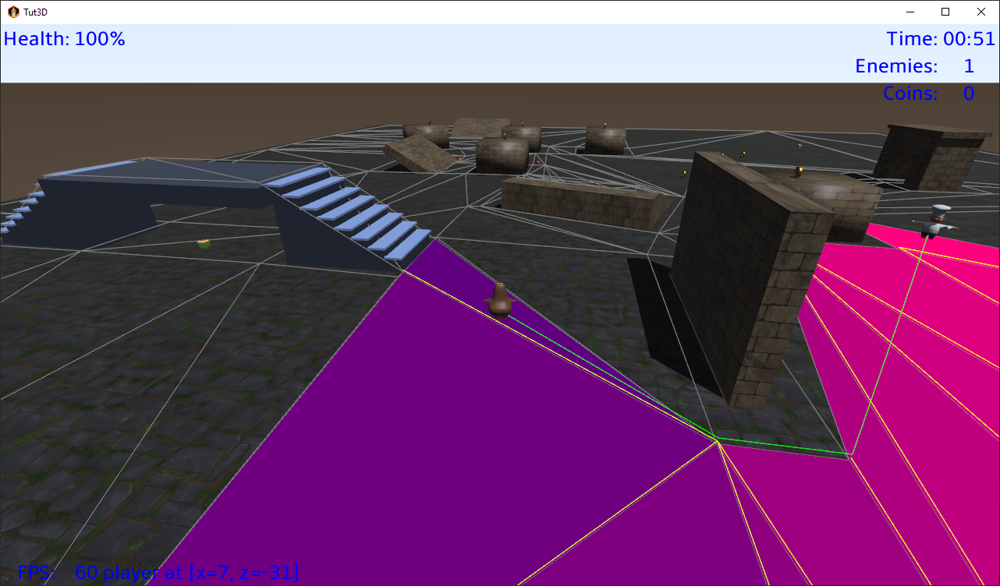

# 3D Tutorial - Step 19 - Navigation Mesh
by Monstrous Software


# Step 19 - Navigation Mesh

Up to now the enemy characters have used a very simplistic routing logic.  They try to move in a straight line towards the player position. They stop at some specific distance from the player so they can throw their pans from there.  If they encounter an obstacle they will probably get stuck, although sometimes the collision response between a capsule shape and a wall will help the enemy slide along the wall towards a corner.

Even this simplistic logic works surprisingly well, but this in part because the map is very open and the player is probably moving around a lot so the enemies never get stuck for very long.

But it can be improved by making use of a so-called navigation mesh, navmesh for short.  This is a data structure that can be used by navigation actors, such as the enemies, to find a smart path from A to B.
In our case we will use it for the enemies to find a smart path towards the player.  In other words, all the navigation actors will have the same target. If different actors have different targets, e.g. an enemy will look for a health pack when they are low on health, it would need to be adapted.

To determine a smart route for the enemies we will follow four steps:
1. Construct a navigation mesh for the environment to define which areas are walkable and how they are connected.
2. Determine for each enemy the shortest path, as a sequence of nodes, to reach the player’s node. 
3. Then for each node path, construct an efficient sequence of way points through the node path so that the route never goes outside the node list and the path goes as close to inside corners as possible.  This is known as a string pulling algorithm.

A navigation mesh is a data structure that represents areas in the map (called ‘nodes’) and the connections between them.  In general, nodes can be any convex polygon. In our case, we will use triangles because we can conveniently extract triangles from a 3d model.

In fact, we can construct the navmesh by hand in 3d modelling software such as Blender.

It is a little bit tedious but not so difficult in Blender because our map is quite simple.  Add a plane and call it “NAVMESH”. Select it and switch to Edit mode and select Top view.  Then select edges and extrude them to fit the open walkable space.  You can select vertices and reposition them.  Leave some space from the walls so that the characters don’t get stuck in walls or on corners.  These gaps should be roughly equivalent to the radius of your character.  Try to make sure that vertices which are at the same location are merged and keep the mesh as simple as possible. 



In Blender, the mesh is mostly composed of quads. When exported as GLTF file, these will be converted to triangles.
In our game we will load the object from the GLTF file into a Scene object and then use the mesh of its ModelInstance 
to construct the nav mesh.

Of course, creating a nav mesh by hand is not ideal. And it needs to be redone whenever you change the map. 
There are techniques to generate a navmesh automatically, but we’ll leave these for another day.


Let us first define a class for a node in the navigation mesh, a simple triangle with an id value for aid in debugging.

```java
        public class NavNode {
            public final int id;
            public final Vector3 p0, p1, p2;
        
            public NavNode( int id, Vector3 a, Vector3 b, Vector3 c) {
                this.id = id;
                p0 = new Vector3(a);
                p1 = new Vector3(b);
                p2 = new Vector3(c);
            }
        }
```

Now we can create a class to represent a navigation mesh. It stores the mesh as an Array of NavNode objects:


```java
public class NavMesh {
    public Array<NavNode> navNodes;         // nodes in nav mesh (triangles)


    // create a navigation mesh from the mesh of a model instance
    //
    public NavMesh() {
        navNodes = new Array<>();
    }
}
```

Let us write some code to create a list of nodes from the mesh of a ModelInstance object.  We already saw earlier some code to go through each triangle of a ModelInstance.  This code will be similar.
We'll create a NavMeshBuilder class that will construct a NavMesh object from the mesh of a ModelInstance.

It turns out that some triangles we extract from the mesh are actually not triangles at all.  This is an artifact of the way we build the mesh, or maybe from the conversion.  Sometimes two corners of the triangle
have exactly the same position.  We will filter out such degenerate triangles and only retain proper triangles as nodes.


```java
public class NavMeshBuilder {

    // create a navigation mesh from the mesh of a model instance
    //
    public static NavMesh build(ModelInstance instance) {

        Mesh mesh = instance.nodes.first().parts.first().meshPart.mesh;
        int primitiveType = instance.nodes.first().parts.first().meshPart.primitiveType;
        if (primitiveType != GL20.GL_TRIANGLES)
            throw new RuntimeException("Nav mesh must be GL_TRIANGLES");

        int numVertices = mesh.getNumVertices();
        int numIndices = mesh.getNumIndices();
        int stride = mesh.getVertexSize() / 4;        // floats per vertex in mesh, e.g. for position, normal, textureCoordinate, etc.

        float[] vertices = new float[numVertices * stride];
        short[] indices = new short[numIndices];
        // find offset of position floats per vertex, they are not necessarily the first 3 floats
        int posOffset = mesh.getVertexAttributes().findByUsage(VertexAttributes.Usage.Position).offset / 4;

        mesh.getVertices(vertices);
        mesh.getIndices(indices);

        NavMesh navMesh = new NavMesh();
        Vector3 corners[] = new Vector3[3];
        for (int i = 0; i < 3; i++)
            corners[i] = new Vector3();

        int id = 0;
        for (int i = 0; i < numIndices; i += 3) {
            for (int j = 0; j < 3; j++) {
                int index = indices[i + j];
                float x = vertices[stride * index + posOffset];
                float y = vertices[stride * index + 1 + posOffset];
                float z = vertices[stride * index + 2 + posOffset];
                corners[j].set(x, y, z);
            }
            // skip degenerate triangles (i.e. where two corners are the same)
            if (corners[0].epsilonEquals(corners[1]) ||
                    corners[1].epsilonEquals(corners[2]) ||
                    corners[2].epsilonEquals(corners[0])) {
                // if this is not really a triangle because 2 verts are identical, or very close
                // mark it as degenerate and always fail isPointInTriangle() because the calculations won't work
                Gdx.app.log("degenerate triangle: " + i / 3, "will be ignored");
            } else {
                NavNode node = new NavNode(id++, corners[0], corners[1], corners[2]);
                navMesh.navNodes.add(node);
            }
        }
        Gdx.app.log("Nav Nodes:", "" + navMesh.navNodes.size);
        return navMesh;
    }
}
```

This extracts the triangles from the mesh and stores it as an array of nodes. Now to add the connections between node.
Two triangles are connected if they share an edge. Let us update the NavNode class to keep a list of neighbours.  A triangle can have a maximum of three neighbours so we
can define the Array capacity as 3 to save memory. (The default Array capacity is 16 and is expanded as necessary). 


```java
public class NavNode {
    public final int id;
    public final Vector3 p0, p1, p2;
    public Array<NavNode> neighbours;

    public NavNode( int id, Vector3 a, Vector3 b, Vector3 c) {
        this.id = id;
        neighbours = new Array<>(3);
        p0 = new Vector3(a);
        p1 = new Vector3(b);
        p2 = new Vector3(c);
    }

    public void addNeighbour( NavNode nbor  ){
        neighbours.add(nbor);
    }
```

Having added a way to keep track of the neighbours of each node, we can now add the following code to  NavMeshBuilder to determine which triangles are connected.

Note: A first attempt of this code checked if two triangles shared the same index values.  However, it turned out there were some duplicate vertices in the handcrafted mesh. So a more
robust approach is to compare the positions of vertices.  And to allow for floating point errors or vertices which are very close together, we use `Vector3.epsilonEquals()` to compare them.

(Another approach would be to process the index and vertex arrays first to remove duplicate vertices).

In this code we check each pair of triangles and consider them connected if exactly two vertices of the first 
triangle appear also in the second triangle. If so, we call `addNeighbour()` on both nodes to add the other node as a neighbour.


```java
        public static NavMesh build(ModelInstance instance) {
            
            ...
        
            // now determine connectivity between triangles, i.e. which triangles share two vertices?
            int links = 0;
            for(int i = 0; i < navMesh.navNodes.size; i++) {
                // note: multiple vertices can be equivalent, i.e. have same position, so check on position equivalence
                // not just if triangles use the same indices.
                // (Alternative would be to deduplicate such vertices before to share the same index)
                Vector3 p0 = navMesh.navNodes.get(i).p0;
                Vector3 p1 = navMesh.navNodes.get(i).p1;
                Vector3 p2 = navMesh.navNodes.get(i).p2;
                for(int j = 0; j < i; j++) {
                    Vector3 q0 = navMesh.navNodes.get(j).p0;
                    Vector3 q1 = navMesh.navNodes.get(j).p1;
                    Vector3 q2 = navMesh.navNodes.get(j).p2;
                    int matches = 0;
                    if(p0.epsilonEquals(q0) || p0.epsilonEquals(q1) || p0.epsilonEquals(q2))
                        matches++;
                    if(p1.epsilonEquals(q0) || p1.epsilonEquals(q1) || p1.epsilonEquals(q2))
                        matches++;
                    if(p2.epsilonEquals(q0) || p2.epsilonEquals(q1) || p2.epsilonEquals(q2))
                        matches++;
                    if(matches == 3)
                        throw new RuntimeException("Duplicate triangles");
                    if(matches == 2){
                        navMesh.navNodes.get(i).addNeighbour(navMesh.navNodes.get(j));
                        navMesh.navNodes.get(j).addNeighbour(navMesh.navNodes.get(i));
                        links++;
                    }
                }
            }
            Gdx.app.log("Nav Node Connections:", ""+links);
            return navMesh;
        }
```

To locate the node that a character is in, we need a method to check if a point is inside a node.
For this we add the following method to NavNode which makes use of the standard LibGDX method `Intersector.isPointInTriangle()`.
However, this method assumes the point is in the plane of the triangle.
So first we need to project the point to this plane, because our game object positions are not at floor level but 
at the center of the collision geometry. 
After we've projected the point down to ground level (or rather: the plane of the triangle), we can check if it is inside the triangle.  

For this we need to calculate the normal vector of the node, i.e. a unit vector that is perpendicular to the triangle.  
This we can calculate as the normalized cross product of two edges.

We can find the distance of a point to a plane by using the plane equation: *Ax + By + Cz + d = 0*, where *(A, B, C)* is the normal vector and (x, y, z) is the point.
We can find the value of *d* by solving the plane equation for one of the vertices of the triangle (which by definition lies on the triangle plane):         

        d = -(normal.x*a.x + normal.y*a.y + normal.z*a.z);

In the method `isPointInTriangle()` we calculate the distance of the point to the node's plane.  
If the distance is negative, the point is below the plane (e.g. the enemy is walking under a bridge) and we return
false.  If the distance is too large (compared to the height of the character), it means the character is not stood on the plane, 
and we also return false. For example, if the enemy is walking over a bridge we don't want to match with nodes underneath the bridge, 
only with the one just below the feet.

```java
public class NavNode {
    public final int id;
    public final Vector3 p0, p1, p2;
    public Array<NavNode> neighbours;
    public Vector3 normal;
    private float d;        // for plane equation

    public NavNode( int id, Vector3 a, Vector3 b, Vector3 c) {
        normal = new Vector3();

        Vector3 t1 = new Vector3(a);
        t1.sub(b);
        Vector3 t2 = new Vector3(c);
        t2.sub(b);
        normal.set(t2.crs(t1)).nor();      // use cross product of two edges to get normal vector (direction depends on winding order)

        // use a point on the plane (a) to find the distance value d of the plane equation: Ax + By + Cz + d = 0, where (A,B,C) is the normal
        d = -(normal.x*a.x + normal.y*a.y + normal.z*a.z);
    }

    public boolean isPointInTriangle(Vector3 point, float maxDist)
    {
        // project point onto plane of the triangle
        float distanceToPlane = point.dot(normal)+d;
        if(distanceToPlane < 0) // point needs to be above the plane
            return false;
        if(distanceToPlane > maxDist)       // triangle too far below point, discard
            return false;
        p.set(normal).scl(-distanceToPlane);                // vector from point to plane, subtract this from point
        p.add(point);

        return Intersector.isPointInTriangle(p, p0, p1, p2);
    }
}
```

We can now add a method to NavMesh to determine which node a point (for example the player or an enemy) is in.  This is a very basic linear search.  It will be executed a lot so 
if the navmesh grows larger, it's probably a good idea to use some spatial data structure instead (e.g. octrees, quadtrees).

```java
    public NavNode findNode( Vector3 point, float maxDist ){
        for(NavNode node : navNodes ) {
            if(node.isPointInTriangle(point, maxDist)) {
                return node;
            }
        }
        return null;
    }
```


Now we come to step 2 of our approach which is needed to find the shortest path from an enemy to the player.  For this we use Dijkstra's algorithm.  (An alternative would be the A* algorithm, which is slightly
more complex but may be faster to find a path).

For this algorithm, we add two new fields to the NavNode class: `int steps;` and `NavNode prev;`. The first one is to store the distance
from the start.  The second one is to point to the node's neighbour which is closest to the start.

The node that the enemy is in has of course a distance of zero steps.  Its immediate neighbours have a distance of 1 step.
The algorithm continues to assign a distance to each node by visiting all nodes via the neighbour connections and increasing the 
number of steps for each connection we follow. 
However, if a node can be reached via different paths it will be marked with the smallest distance. If we find the target node we can exit the loop.
The path that the enemy needs to take can be found by following the `prev` references, and then reversing the sequence. 

We need to run this algorithm every time the player moves to another node.  Enemy movement from one node to another does not require a recalculation of the path, because 
we assume that the enemy will be strictly following this given path.

```java
    // find the shortest node path from start to end node
    public void findNodePath( NavNode startNode, NavNode endNode, Array<NavNode> nodePath ) {

        // Dijkstra's algorithm
        //
        Array<NavNode> Q = new Array<>();

        for(int i = 0; i < navNodes.size; i++){
            NavNode node = navNodes.get(i);
            node.steps = Integer.MAX_VALUE;
            node.prev = null;
            Q.add(node);
        }
        startNode.steps = 0;
        startNode.prev = null;
        NavNode node = null;

        while(Q.size > 0) {
            // find node in Q with minimal distance
            int minSteps = Integer.MAX_VALUE;
            node = null;
            for(NavNode n : Q){
                if(n.steps < minSteps){
                    minSteps = n.steps;
                    node = n;
                }
            }
            if(node == endNode)    // arrived at end node, we can stop now
                break;
            Q.removeValue(node, true);
            for(NavNode nbor :  node.neighbours){
                if(Q.contains(nbor, true)){
                    int alt = node.steps + 1;
                    if(alt < nbor.steps){
                        nbor.steps = alt;
                        nbor.prev = node;
                    }
                }
            }
        } // while


        nodePath.clear();
        while (node != null) {
            nodePath.add(node);
            node = node.prev;
        }
        nodePath.reverse();
    }
```


To visualize what is happening we can create a view class to render the nodes of the navmesh and give each node a colour depending on its step value.
This uses MeshBuilder to create a render model every time `update()` is called. This is a relatively expensive operation but it is only used in debug view
and it doesn't seem to affect frame rate too badly in practice.

By calling `update()` and `render()` in the main render loop, after the game world itself has been rendered we can see the navmesh triangles, with the distance to the player
shaded from red to blue. As the player runs around we can see that the colours adapt.

This is also a good moment to check the whole nav mesh is continuous, i.e. all the corners are reached.  
If there are issues of connectivity between nodes (a poorly constructed nav mesh), you could have multiple "islands" which appear not connected and 
you may need to check the mesh for duplicate vertices that need to be merged.


```java
public class NavMeshView implements Disposable {

    private final ModelBatch modelBatch;
    private ModelBuilder modelBuilder;
    private Array<ModelInstance> instances;
    private Array<Model> models;

    public NavMeshView() {
        modelBatch = new ModelBatch();
        instances = new Array<>();
        models = new Array<>();
    }

    public void render( Camera cam ) {
        modelBatch.begin(cam);
        modelBatch.render(instances);
        modelBatch.end();
    }

    public void update( World world ) {
        for(Model model : models)
            model.dispose();
        models.clear();
        instances.clear();

        buildNavNodes(world.navMesh.navNodes);
    }

    private void buildNavNodes(Array<NavNode> path ) {
        if (path == null || path.size == 0) {
            return;
        }

        modelBuilder = new ModelBuilder();
        modelBuilder.begin();
        MeshPartBuilder meshBuilder;

        for(NavNode navNode : path ) {

            Material material = new Material(ColorAttribute.createDiffuse((float)(16-navNode.steps)/16f, 0, .5f, 1));   // colour shade depends on distance to target
            meshBuilder = modelBuilder.part("part", GL20.GL_TRIANGLES, VertexAttributes.Usage.Position, material);

            meshBuilder.ensureVertices(3);
            short v0 = meshBuilder.vertex(navNode.p0.x, navNode.p0.y, navNode.p0.z);
            short v1 = meshBuilder.vertex(navNode.p1.x, navNode.p1.y, navNode.p1.z);
            short v2 = meshBuilder.vertex(navNode.p2.x, navNode.p2.y, navNode.p2.z);
            meshBuilder.ensureTriangleIndices(1);
            meshBuilder.triangle(v0, v1, v2);
        }
        Model model = modelBuilder.end();
        ModelInstance instance = new ModelInstance(model, Vector3.Zero);
        models.add(model);
        instances.add(instance);
    }

    @Override
    public void dispose() {
        modelBatch.dispose();
        for(Model model : models)
            model.dispose();
    }
}
```



    
For step 3, we will use an algorithm called ["Simple Stupid Funnel Algorithm"](https://digestingduck.blogspot.com/2010/03/simple-stupid-funnel-algorithm.html) by Mikko Mononen to find a nice tight route through the nodes
for the enemy to reach the player. In particular, we want the route to follow straight lines as much as possible and to hug inside corners. This is also called a string pulling algorithm.
Imagine you thread a string through the sequence of nodes we found before and then we pull it tight.

This algorithm steps through a sequence of "portals".  A portal is nothing more than the edge between two nodes on the path. Each portal has a left and a right vertex as seen from the first node. 
(The algorithm is essentially a 2d algorithm.  We can use it in a 3d game as long as the movement is mostly horizontal, e.g. we cannot walk up a vertical wall).
We add a boolean to indicate if there is a slope change at this portal, for example if the edge is
at the bottom of a ramp.

The Portal class is defined as follows:

```java
            // a portal is an edge between two adjacent nodes (i.e. triangles) on the path
            public static class Portal {
                public Vector3 left;
                public Vector3 right;
                public boolean slopeChange;     // indicator if portal connects nodes with different slope
        
                public Portal(Vector3 left, Vector3 right, boolean slopeChange) {
                    this.left = new Vector3(left);
                    this.right = new Vector3(right);
                    this.slopeChange = slopeChange;
                }
            }
```


We will use the following method to find the shared edge between two connected triangles.  We return the start and end vector of the connecting edge.
Since our triangles are by convention counter-clockwise, this means the start will be the right vertex and the end will be the left vertex of the portal as we move
from node a to node b.

```java
    // get the edge between two triangles that we know are connected
    private void getEdge(NavNode a, NavNode b, Vector3 start, Vector3 end ){

        boolean p0matches = (a.p0.epsilonEquals(b.p0) || a.p0.epsilonEquals(b.p1)|| a.p0.epsilonEquals(b.p2) );
        boolean p1matches = (a.p1.epsilonEquals(b.p0) || a.p1.epsilonEquals(b.p1)|| a.p1.epsilonEquals(b.p2) )
        boolean p2matches = (a.p2.epsilonEquals(b.p0) || a.p2.epsilonEquals(b.p1)|| a.p2.epsilonEquals(b.p2) )

        if(p0matches && p1matches){
            start.set(a.p0);
            end.set(a.p1);
        }
        else if(p1matches && p2matches){
            start.set(a.p1);
            end.set(a.p2);
        }
        else if(p2matches && p0matches){
            start.set(a.p2);
            end.set(a.p0);
        }
        else
            throw new RuntimeException("Cannot match edges");
    }
```

The string pulling algorithm is implemented in method `makePath()`. 
First it build an array of portals based on the array of navigation nodes we built earlier with `findNodePath()`.
A slope change is detected by taking the dot product of the normals of both nodes.  If both normals
are pointing the same way the dot product is 1.  If the dot product is less than one, the two nodes have
a different slope.

Then it uses a funnel shape (an apex, a left foot and a right foot) to step through the portals one by one. 
First moving the right foot to the right side of a portal, then the left foot to the left side of a portal. 
Then advancing to the next portal.  If we cannot move a foot because the portal side is hidden around a corner, we skip it.  
This can be detected because the line from the apex to the portal side falls outside the funnel.  
If moving a foot to the next portal side means the feet would cross each other, we move the funnel to the previous foot position and we restart. 
In this case we add a waypoint to the new apex position.

To check if two vectors are crossing each other we use the `area()` method where we basically determine the sign of the (2d) cross product. For example, if the funnel has a negative area it means the two legs are crossed.

We adapt the algorithm a little to force a waypoint whenever a portal indicates a slope change.


```java
    // string pulling algo:
    public static void makePath(Vector3 startPoint, Vector3 targetPoint, Array<NavNode> nodePath, Array<Vector3> pointPath ) {

        Array<Portal> portals = new Array<>();
        Vector3 edgeStart = new Vector3();
        Vector3 edgeEnd = new Vector3();

        // build a list of portals, i.e. edges between triangles on the node path to the goal

        portals.clear();
        portals.add(new Portal(startPoint, startPoint, false));

        for (int i = 0; i < nodePath.size - 1; i++) {
            NavNode node = nodePath.get(i);
            NavNode nextNode = nodePath.get(i + 1);
            getEdge(node, nextNode, edgeStart, edgeEnd);
            boolean slopeChange = ( node.normal.dot(nextNode.normal) < 0.99f ); // use dot product of normals to detect slope change
            portals.add(new Portal(edgeEnd, edgeStart, slopeChange));
        }

        portals.add(new Portal(targetPoint, targetPoint, false));

        // use the portals to create a list of way points
        pointPath.clear();
        pointPath.add(new Vector3(startPoint));

        // define a funnel with an apex, a left foot and a right foot
        Vector3 apex = startPoint;
        Vector3 leftFoot = startPoint;
        Vector3 rightFoot = startPoint;
        int apexIndex = 0, leftIndex = 0, rightIndex = 0;

        for (int i = 1; i < portals.size; i++) {
            Portal portal = portals.get(i);

            // update right leg
            if ( area(apex, rightFoot, portal.right) <= 0) {
                if (apex.epsilonEquals(rightFoot) || area(apex, leftFoot, portal.right) > 0f) {
                    // tighten the funnel
                    rightFoot = portal.right;
                    rightIndex = i;
                } else {
                    // right over left,insert left into path and restart scan from left foot
                    pointPath.add(new Vector3(leftFoot));
                    apex = leftFoot;
                    apexIndex = leftIndex;
                    // reset portal
                    leftFoot = apex;
                    rightFoot = apex;
                    leftIndex = apexIndex;
                    rightIndex = apexIndex;
                    i = apexIndex;
                    continue;
                }
            }
            // update left leg
            if (area(apex, leftFoot, portal.left) >= 0) {
                if (apex.epsilonEquals(leftFoot) || area(apex, rightFoot, portal.left) < 0f) {
                    // tighten the funnel
                    leftFoot = portal.left;
                    leftIndex = i;
                } else {
                    // left over right, insert right into path and restart scan from right foot
                    pointPath.add(new Vector3(rightFoot));
                    apex = rightFoot;
                    apexIndex = rightIndex;
                    // reset portal
                    leftFoot = apex;
                    rightFoot = apex;
                    leftIndex = apexIndex;
                    rightIndex = apexIndex;
                    i = apexIndex;
                    continue;
                }
            }

            // force a way point on a slope change so that the path follows the slopes (e.g. over a bridge)
            // this is an addition to SSFA
            if(portal.slopeChange){
                Vector3 wayPoint = new Vector3(portal.left).add(portal.right).scl(0.5f);    // mid point of portal
                pointPath.add( wayPoint );
                apex = wayPoint;
                apexIndex = i;
                // reset portal
                leftFoot = apex;
                rightFoot = apex;
                leftIndex = apexIndex;
                rightIndex = apexIndex;
                continue;
            }
        }
        // add end point if it was skipped
        if(pointPath.size == 1 || !pointPath.get(pointPath.size-1).epsilonEquals(targetPoint))
            pointPath.add(new Vector3(targetPoint) );
    }


    // 2d function to test if triangle a,b,c has positive or negative area, negative means the funnel legs are crossed
    private float area(Vector3 a, Vector3 b, Vector3 c) {
        float ax = b.x - a.x;
        float az = b.z - a.z;
        float bx = c.x - a.x;
        float bz = c.z - a.z;
        return - (bx*az - ax*bz);
    }
```

The following picture shows the string pulling in action. The green line shows the shortest path from the enemy to the player that stays within the nodes.  
The yellow triangle edges are the portals mentioned before which are the edges between the triangles along the path.




The logic of creating a node path and then string pulling to get a sequence of way points is combined in a new method called `makePath()`.
If the start or end happens to fall outside the nav mesh, we use the closest node.  We also make sure the start and point are at the ground level (node level).
The node path and point path are regenerated whenever the player moves more than some amount.

```java
    private Vector3 start = new Vector3();
    private Vector3 destination = new Vector3();

    // returns true if path was rebuilt
    public boolean  makePath( Vector3 startPoint, Vector3 targetPoint, Array<NavNode> navNodePath, Array<Vector3> pointPath ) {
        NavNode startNode = findNode(startPoint, Settings.navHeight);
        NavNode endNode = findNode(targetPoint, Settings.navHeight);

        start.set(startPoint);
        if(startNode == null) {
            startNode = findClosestNode(startPoint);        // use a reachable start, since the nav actor is outside the nav mesh
            start.set(startNode.centre);
        }

        destination.set(targetPoint);
        if(endNode == null) {
            endNode = findClosestNode(targetPoint);
            destination.set(endNode.centre);               // use a reachable destination, since the target is outside the nav mesh
        }

        // put start and end points at node height (on a slope this will be an approximation)
        start.y = startNode.centre.y;
        destination.y = endNode.centre.y;

        // if the target has moved (more than a margin), we need to recalculate
        // we assume the start node is following the node path, so we only check the end of the path versus the target
        if(navNodePath.size == 0 || pointPath.size == 0 || !destination.epsilonEquals(pointPath.get(pointPath.size-1), TARGET_MARGIN)) {
            findNodePath(startNode, endNode, navNodePath);
            NavStringPuller.makePath(start, destination, navNodePath, pointPath);
            return true;
        }
        return false;
    }
```

The enemy movement logic can now be coded as follows.  The enemy object calls the nav mesh object to get an updated path.  
If the player did not move, the existing path can be reused.  
Then the enemy character moves from waypoint to waypoint following the path vectors. 
When the enemy position has reached a waypoint, it targets the next waypoint.   The method `getWayPoint()` returns the next way point that
the character should be moving towards.  It also provides a method `getSlope()` that returns the height difference between way points.
This is handy to handle ramps, which we've seen can cause difficulties for collision response.

We will code this logic in a class called `NavActor`:

```java
        public class NavActor {
            public static float CLOSE = 1f;
        
            private NavMesh navMesh;
            public Array<NavNode> navNodePath;
            public Array<Vector3> path;
            private int wayPointIndex;
            private Vector3 wayPoint;
        
            public NavActor(NavMesh navMesh) {
                this.navMesh = navMesh;
                path = new Array<>();
                navNodePath = new Array<>();
            }
        
            // get next point to aim for
            public Vector3 getWayPoint( Vector3 actorPosition, Vector3 targetPosition ) {
                boolean rebuilt = navMesh.makePath(actorPosition, targetPosition, navNodePath, path);
                if(rebuilt) 
                    wayPointIndex = 1;  // path[0] is currentPosition

                wayPoint = path.get(wayPointIndex);
                if (wayPointIndex < path.size - 1 && wayPoint.dst(actorPosition) < CLOSE) {     // reached a waypoint, move to next one
                    wayPointIndex++;
                    wayPoint = path.get(wayPointIndex);
                }
                return wayPoint;
            }
        
            // get a slope value up to next way point: > 0 we have to climb, == 0 horizontal surface
            // assumes you called getWayPoint() before
            public float getSlope() {
                return wayPoint.y - path.get(wayPointIndex-1).y;
            }
        }
```

Now it is time to make the enemy characters make use of this.  This is done in the `update()` method of the `CookBehaviour` class.
This class gets a `NavActor` object as field.  This is used to get the next way point for a route from the enemy position to the player position.
We also use the `getSlope()` method to check if we need to climb up, and if so we temporarily disable gravity on this rigid body.
The enemy's direction is 'slerped' towards the way point, so that the character turns smoothly between path segments.  And then a force is applied
in the direction of the way point.


```java
    public class CookBehaviour extends Behaviour {
        ...
        private final Vector3 direction = new Vector3();
        private final Vector3 targetDirection = new Vector3();
        private final Vector3 playerVector = new Vector3();
        public NavActor navActor;
    
        ...
    
        @Override
        public void update(World world, float deltaTime) {
            if (go.health <= 0)   // don't do anything when dead
                return;
    
            playerVector.set(world.getPlayer().getPosition()).sub(go.getPosition());    // vector to player in a straight line
            float distance = playerVector.len();
    
            if (navActor == null) {   // lazy init because we need world.navMesh
                navActor = new NavActor(world.navMesh);
            }
    
            Vector3 wayPoint = navActor.getWayPoint(go.getPosition(), world.getPlayer().getPosition());  // next point to aim for on the route to target
    
            float climbFactor = 1f;
            if (navActor.getSlope() > 0.1f) {    // if we need to climb up, disable the gravity
                go.body.geom.getBody().setGravityMode(false);
                climbFactor = 2f;       // and apply some extra force
            } else
                go.body.geom.getBody().setGravityMode(true);
    
            // move towards waypoint
            targetDirection.set(wayPoint).sub(go.getPosition());  // vector towards way point
            if (targetDirection.len() > 1f) {    // if we're at the way point, stop turning to avoid nervous jittering
                targetDirection.y = 0;  // consider only vector in horizontal plane
                targetDirection.nor();      // make unit vector
                direction.slerp(targetDirection, 0.02f);            // smooth rotation towards target direction
    
                if (distance > 5f)   // move unless quite close
                    go.body.applyForce(targetDirection.scl(Settings.cookForce * climbFactor));
            }
    
            ...
        }
    }
```


This concludes step 19 where we adapted enemy behaviour to appear smarter by use of a navigation mesh.


