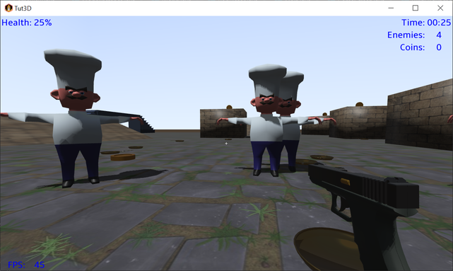

# Tut3D

A [libGDX](https://libgdx.com/) project generated with [gdx-liftoff](https://github.com/tommyettinger/gdx-liftoff).

This is the code repository for the [LibGDX 3D Tutorial](https://github.com/MonstrousSoftware/Tutorial3D).
Use the git tags to get the version corresponding to each step of the tutorial.

## Platforms

- `core`: Main module with the application logic shared by all platforms.
- `lwjgl3`: Primary desktop platform using LWJGL3.
- `teavm`: Experimental web platform using TeaVM and WebGL.
